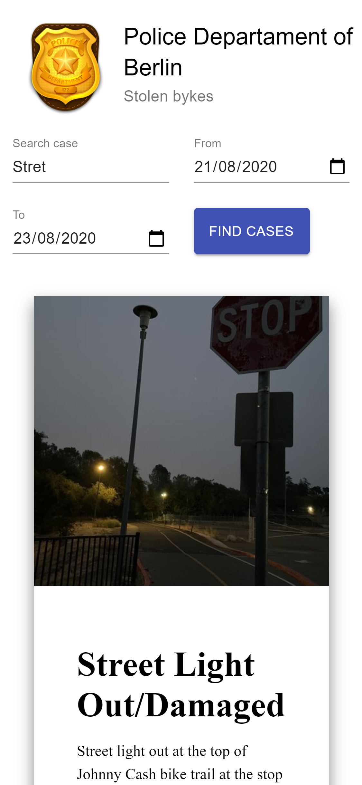
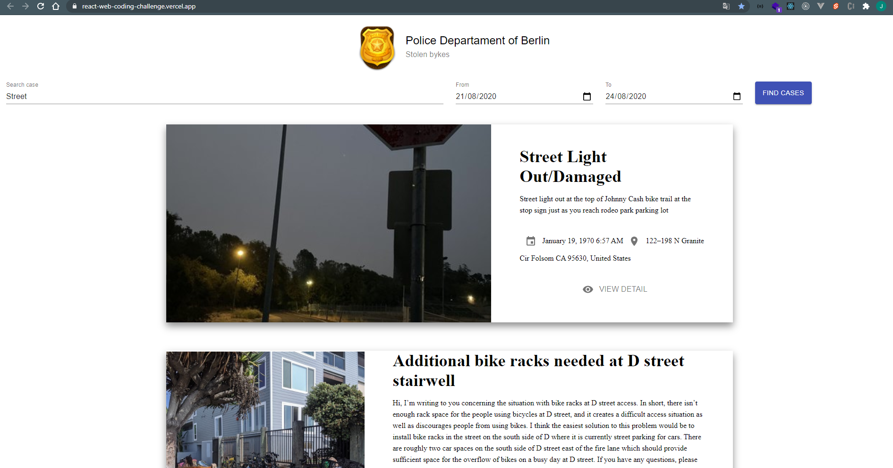

# Chiper Frontend

React web coding challenge.

## Screenshots app

[See the application in https://react-web-coding-challenge.vercel.app/](https://react-web-coding-challenge.vercel.app/)

## How does it work?

Requires Node.JS > 10

- `npm install` To install the dependencies.
- `npm run start` To start the development environment.
- `npm run build` To build the production environment.
- `npm run test` To run the unit tests.
- `npm run test:coverage` To generate the unit test report.

## License

MIT

# Stolen Bike Index - Frontend (React) Conding Challenge

## Context

Stolen bikes are a typical problem in Berlin. The Police want to be more efficient in resolving stolen bike cases. They decided to build a software that can automate their processes — the software that you're going to develop.

This app needs to display the list of reported bike thefts based on the Bikewise [API](https://www.bikewise.org/documentation/api_v2).

## Product Requirements

As a police officer:

- [ ] I want to see a list of reported bike thefts for the Berlin area.
- [ ] I want to see the first 10 bike theft cases, with the ability to - paginate (10 cases per page).
- [ ] I want to see a total number of bike theft cases.
- [ ] For each reported bike theft I want to see:
  - [ ] Case title
  - [ ] Case description
  - [ ] Date of the theft
  - [ ] Date of when the case was reported
  - [ ] Location of the theft
  - [ ] Picture of the bike, if available
- [ ] I want to filter reported bike thefts by partial case title.
- [ ] I want to filter reported bike thefts by date range.
- [ ] I want to see a loading state until the list is available.
- [ ] I want to see an error state if the list is unavailable.
- [ ] I want to see an empty state if there are no results.

## Your Mission

Create the React application that satisfies all must-have requirements above, plus any nice-to-have requirements you wish to include.

For that, you’ll need to make requests to a publicly-available [API](https://www.bikewise.org/documentation/api_v2) to get JSON content and print it on view. 

The API is known to have some limitations. If you are not able to implement a particular requirement, please provide a description of what and why you could not implements.

For the layout of each page, please refer to the provided wireframes:

- [Index page](./screens/index.png)
- [Error state](./screens/index_error.png)
- [Empty state](./screens/index_empty.png)
- [Loading state](./screens/index_loading.png)

Also, you can take inspiration from these resources:

- [BikeIndex](https://bikeindex.org/bikes?serial=&button=&location=Berlin&distance=100&stolenness=proximity)
- [BikeWise](https://bikewise.org)

You can use any boilerplate/approach you prefer (nextjs, create react app, ...), but try to keep it simple. We encourage you to use your favorite tools and packages to build a solid React application.

You can assume that you do not have to support legacy browsers. Feel free to use modern features such as **fetch** or **flexbox**.

Host the website on the service of your choice (zeit, Heroku, AWS, GCloud, ...)

## Tech Requirements

- React
- Tests: Jest + react-testing-library / enzyme
- Code Linter
- Typescript is a plus
- CSSinJS is a plus: styled-components, styled-system, ...

## Instructions

- Fork this repo
- The challenge is on!
- Build a performant, clean and well-structured solution
- Commit early and often. We want to be able to check your progress
- Make the app public. Deploy it using the service of your choice
- Create a pull request
- Please complete your working solution within 5 days of receiving this challenge, and be sure to notify us when it is ready for review.

## License

MIT
